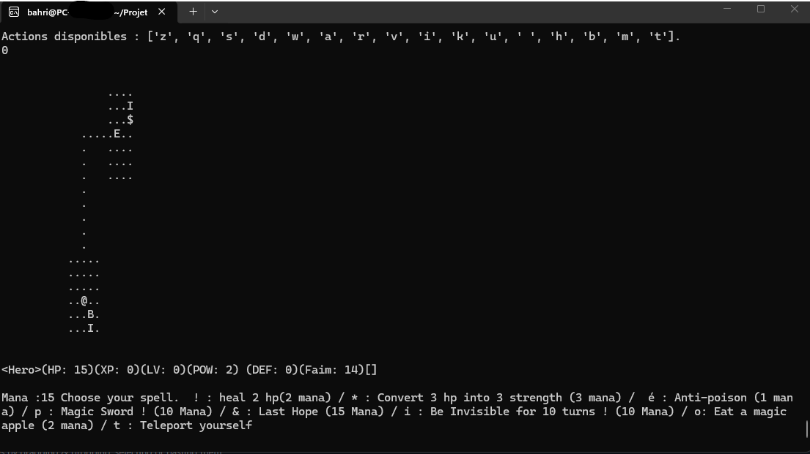

# ⚔️ Terminal RPG Engine (TUI)

<div align="center">

[]()
[]()

[🇺🇸 English Version](#-english-version) | [🇫🇷 Version Française](#-version-française)

</div>

---

## 🇺🇸 English Version

### 📝 Overview
A text-based Role Playing Game (RPG) engine running entirely in the console.
This project focuses on **Object-Oriented Architecture (OOP)** to manage game entities, map rendering, and combat mechanics without relying on external graphical engines.
Made with my co-project friend Dina Soussi-Elyabany

###  Key Features
* **O.O.P. Design:** Modular structure with classes for `Player`, `Enemy`, and `Map`.
* **Custom TUI Engine:** Grid-based system rendering the game state directly in the terminal buffer (ASCII).
* **Combat System:** Turn-based mechanics with health and inventory management.


---

## 🇫🇷 Version Française

### 📝 Présentation
Un moteur de Jeu de Rôle (RPG) textuel fonctionnant entièrement dans la console.
Ce projet met l'accent sur l'**Architecture Orientée Objet (POO)** pour gérer les entités, le rendu de la carte et les combats, sans moteur graphique externe.

###  Fonctionnalités Clés
* **Conception Orientée Objet :** Structure modulaire avec classes `Joueur`, `Ennemi` et `Carte`.
* **Moteur TUI Personnalisé :** Système basé sur une grille affichant l'état du jeu directement dans le terminal (ASCII).
* **Système de Combat :** Mécanique au tour par tour avec gestion de vie et d'inventaire.

---

### 📦 Installation

```bash
git clone [https://github.com/OthmaneBahri/Terminal-RPG-Engine.git](https://github.com/OthmaneBahri/Terminal-RPG-Engine.git)
./main.py

📅 Project Context

    Date: March 2024 / Mars 2024

    Role: Lead Developer & Architect

